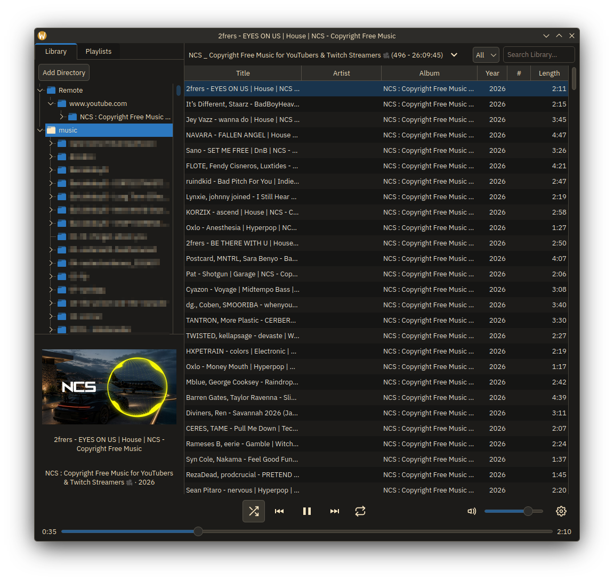
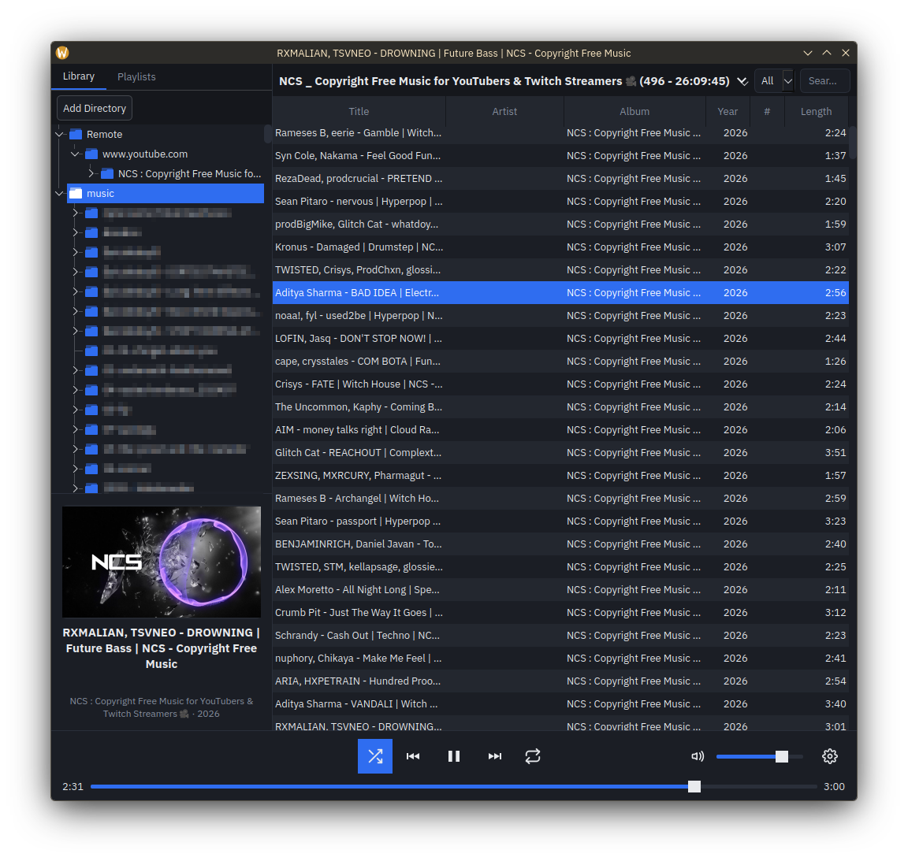
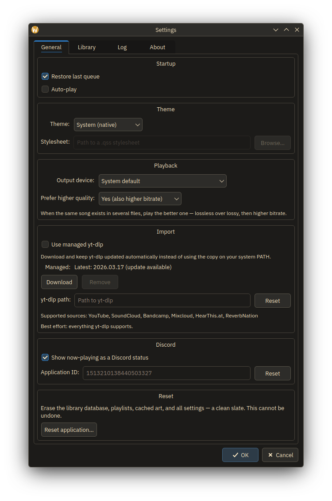
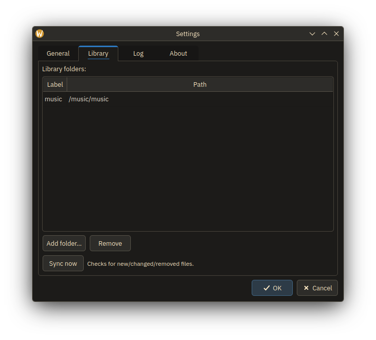
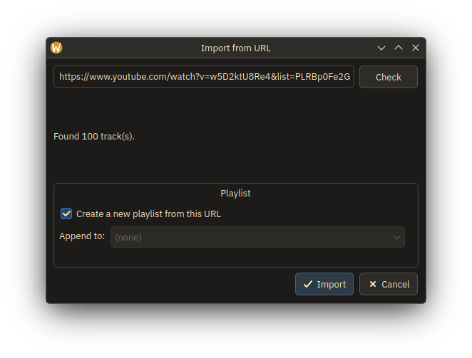
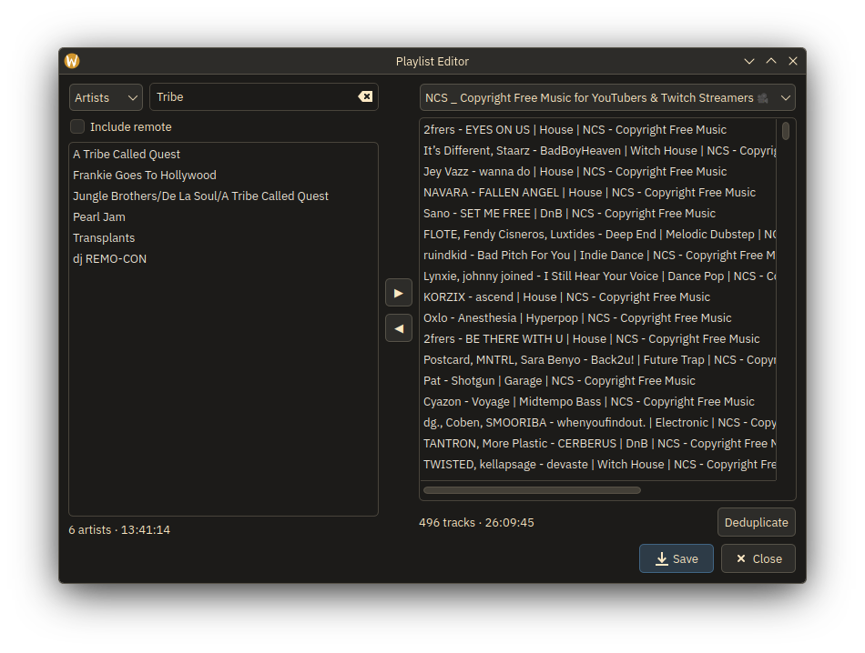

# Pocket Player
A media player.


Written by Claude Code, Opus 4.8 - low effort. `/usage` estimates around 280 USD in tokens. (Random evaluation by max effort)


I haven't read most of this, initially an experiment and turned out okay.


## Features
- Intentionally Simple
- Local media playback (duh)
  - Multiple media sources
  - Metadata via TagLib, cached to SQLite db
- Local media info via taglib
- Remote media streaming via `yt-dlp`
  - Treated transparently-ish, indexed into DB with local media
  - Imported via `yt-dlp`
  - Few specific sites handled: YouTube, Soundcloud, Bandcamp, ReverbNation, HearThis.at
  - Best-effort for Artist, Album, etc; for everything else `yt-dlp` supports.
- Mixed playlists with local and remote media, saved as m3u8
- MPRIS on Linux, MediaSession on MacOS
- Self-managed `yt-dlp`, or checks `$PATH`


## In-Progress (by prio)
- Import resume
 - probably another table for imports, dump from `yt-dlp --flat-playlist`, check against tracks table
- DB invalidation improvements (probably too fragile as-is)
- Checking for new updates via GH latest/releases
- Better custom stylesheet support
- Windows build *sigh*
- Handful of UI tweaks
  - Spacing of elements
  - Horizontal collapsing is wonky
  - Better matching Qt6 to MacOS
  - Probably tweaks to match Windows *sigh*
- Building on Woodpecker -> push to GH releases
  - AppImage pipeline scaffolded (`.woodpecker.yml`); release-publish step still a placeholder
- MacOS's implementation of SMB is garbage and slow
  - #wontfix but I'm mad
- Edge cases for some interaction
- Human Code Review™

### Maybe
- webdav? I might be the only one who uses this
- Snazzy *audio reactive* shader animations, can see this getting out of hand

## Images
app


theme example


general settings


library settings


playlist importer


playlist editor


## Build

Requires Qt 6 (Core, Gui, Widgets, Multimedia, Sql, Concurrent, Network, SVG,
and DBus on Linux), TagLib, FFmpeg (the Qt Multimedia backend), and a C++17
compiler. `yt-dlp` is an optional runtime dependency for remote streaming.

### Arch Linux

```sh
sudo pacman -S --needed base-devel cmake qt6-base qt6-multimedia qt6-svg taglib ffmpeg
```

Optional: `yt-dlp` for remote streaming/import; `plasma-integration` for native
KDE theming (Breeze + color scheme).

### Compile

```sh
cmake -B build -S . -DCMAKE_BUILD_TYPE=Release
cmake --build build -j
./build/mp3player
```

### Build options

| Option | Default | Effect |
|--------|---------|--------|
| `ENABLE_MPRIS` | `ON` (Linux), `OFF` elsewhere | MPRIS D-Bus media control. Pulls in `Qt6::DBus`; off = no D-Bus dependency. |
| `ENABLE_DISCORD_RPC` | `ON` | Discord Rich Presence (now-playing status). Cross-platform, no extra dependency (talks Discord's local IPC socket via `QLocalSocket`). |
| `DISCORD_APP_ID` | Pocket Player's app | Discord application/client ID baked into the build. Override to use your own app; can also be overridden at runtime in Settings → Discord. |
| `BUILD_SHADER_DEMO` | `OFF` | Build the standalone `QRhiWidget` shader/visualizer demo. |

e.g. `cmake -B build -S . -DENABLE_MPRIS=OFF -DENABLE_DISCORD_RPC=OFF`

### Packaging (Linux AppImage)

```sh
make appimage          # -> Pocket_Player-x86_64.AppImage
```

Builds against the official Qt (aqtinstall, like the macOS build); install it once:

```sh
python3 -m venv ~/.aqt-venv && ~/.aqt-venv/bin/pip install aqtinstall
~/.aqt-venv/bin/aqt install-qt linux desktop 6.11.1 linux_gcc_64 -m qtmultimedia -O ~/Qt
```

See `notes/linux.md` for the details (CI, bundling, styling).

## Layout

| File | Role |
|------|------|
| `src/main.cpp` | Entry point |
| `src/MainWindow.*` | UI: layout, transport, styling |
| `src/PlayerController.*` | Wraps `QMediaPlayer`/`QAudioOutput`, playlist navigation |
| `src/PlaylistModel.*` | `QAbstractListModel` of tracks driving the list view |
| `src/MusicLibrary.*` | Threaded SQLite tag cache + parallel TagLib scan |
| `src/MprisController.*` | MPRIS D-Bus adaptors (optional, `ENABLE_MPRIS`) |

## License

Released into the public domain (or under the BSD Zero Clause License) — final
license to be decided.

## Attribution

Built with:

- **Qt 6** — LGPLv3 — <https://www.qt.io/>
- **TagLib** — LGPLv2.1 / MPL 1.1 — <https://taglib.org/>
- **FFmpeg** — LGPLv2.1+ (Qt Multimedia backend) — <https://ffmpeg.org/>

`album_icon.svg` by Pymouss, own work, Public Domain —
[commons.wikimedia.org](https://commons.wikimedia.org/w/index.php?curid=5793388)
